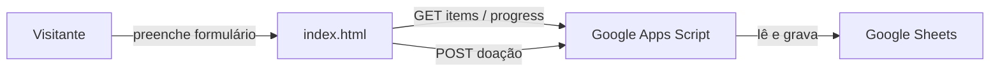

# Cesta Básica · INVB

Aplicação web para arrecadação e registro de doações de alimentos para a composição de cestas básicas da **INVB** (Igreja em Botafogo).

Os participantes informam nome, item e quantidade; o progresso geral é exibido em tempo real conforme as doações são registradas.

---

## Funcionalidades

- Barra de progresso com percentual da meta de arrecadação
- Lista dinâmica de itens disponíveis (com quantidade restante)
- Formulário guiado em etapas (nome → item → quantidade → confirmar)
- Validação de quantidade máxima por item
- Feedback visual e sonoro após confirmação
- Layout responsivo (mobile e desktop)

---

## Tecnologias

| Camada    | Tecnologia                          |
|-----------|-------------------------------------|
| Frontend  | HTML, CSS e JavaScript (vanilla)    |
| Backend   | Google Apps Script                |
| Banco     | Google Sheets                       |
| Hospedagem| GitHub Pages                        |

Não há dependências de build nem framework — o frontend é um único arquivo estático.

---

## Estrutura do repositório

```
cesta-basica/
├── index.html   # Interface da aplicação (v1.2.0)
├── Code.txt     # Código do Google Apps Script (v1.0.0)
├── CNAME        # Domínio customizado do GitHub Pages
└── README.md
```

---

## Como funciona



### Planilha Google Sheets

O backend espera uma planilha com duas abas:

**Aba `Estoque`**

| Coluna | Conteúdo              |
|--------|-----------------------|
| A      | Nome do item          |
| B      | Quantidade total      |
| C      | Quantidade já doada   |

**Aba `Registro`**

Cada doação confirmada adiciona uma linha com: data, nome, produto e quantidade.

### API (Google Apps Script)

| Método | Endpoint / Ação        | Descrição                        |
|--------|------------------------|----------------------------------|
| GET    | `?action=items`        | Lista itens com estoque restante |
| GET    | `?action=progress`     | Retorna `{ percent: N }`         |
| POST   | corpo JSON             | Registra uma doação              |

**Exemplo de corpo POST:**

```json
{
  "nome": "Maria Silva",
  "produto": "Arroz",
  "quantidade": 2
}
```

---

## Configuração

### 1. Google Sheets + Apps Script

1. Crie uma planilha com as abas `Estoque` e `Registro` conforme a estrutura acima.
2. Em **Extensões → Apps Script**, cole o conteúdo de `Code.txt`.
3. Publique como **Aplicativo da Web** (acesso: qualquer pessoa).
4. Copie a URL de implantação gerada.

### 2. Frontend

No `index.html`, atualize a constante `API_URL` com a URL do seu Apps Script:

```javascript
const API_URL = 'https://script.google.com/macros/s/SEU_ID/exec';
```

### 3. GitHub Pages

1. Faça push deste repositório para o GitHub.
2. Em **Settings → Pages**, configure a branch principal como origem.
3. O arquivo `CNAME` já aponta para `cestabasica.invbotafogo.com.br` — ajuste se necessário.
4. Configure o registro DNS `CNAME` do seu domínio para `usuario.github.io`.

### 4. CORS (opcional)

No Apps Script, a constante `ALLOWED_ORIGIN` controla quais origens podem acessar a API. Para produção, substitua `'*'` pelo domínio do site:

```javascript
const ALLOWED_ORIGIN = 'https://cestabasica.invbotafogo.com.br';
```

---

## Uso local

Como é um site estático, basta abrir o `index.html` em um servidor local:

```bash
# Python 3
python -m http.server 8080

# ou com npx
npx serve .
```

Acesse `http://localhost:8080`. A API do Google Apps Script precisa estar publicada e acessível para o formulário funcionar.

---

## Versões

| Componente | Versão |
|------------|--------|
| Frontend   | 1.2.0  |
| Backend    | 1.0.0  |

---

## Licença

Projeto de uso interno da INVB. Consulte os mantenedores antes de reutilizar em outros contextos.
